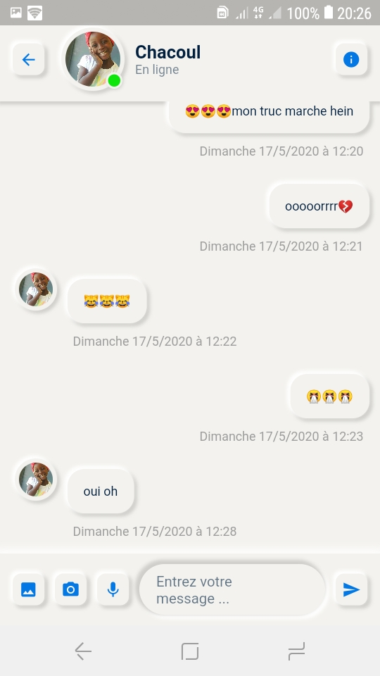
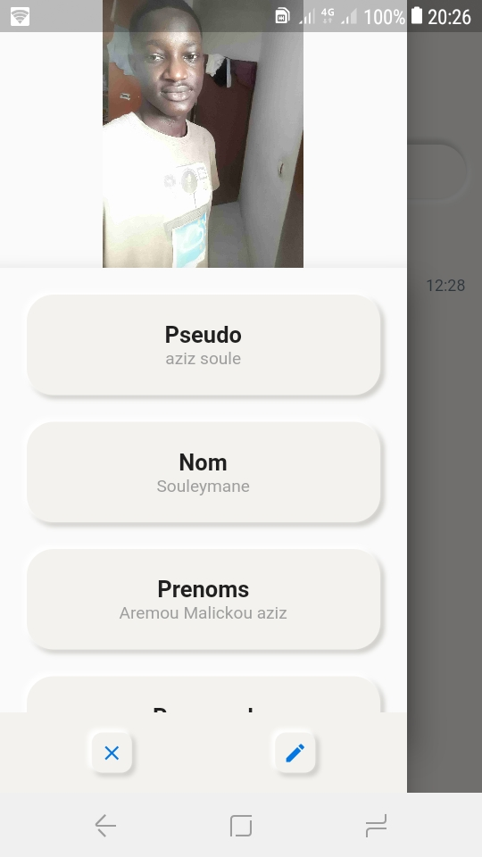
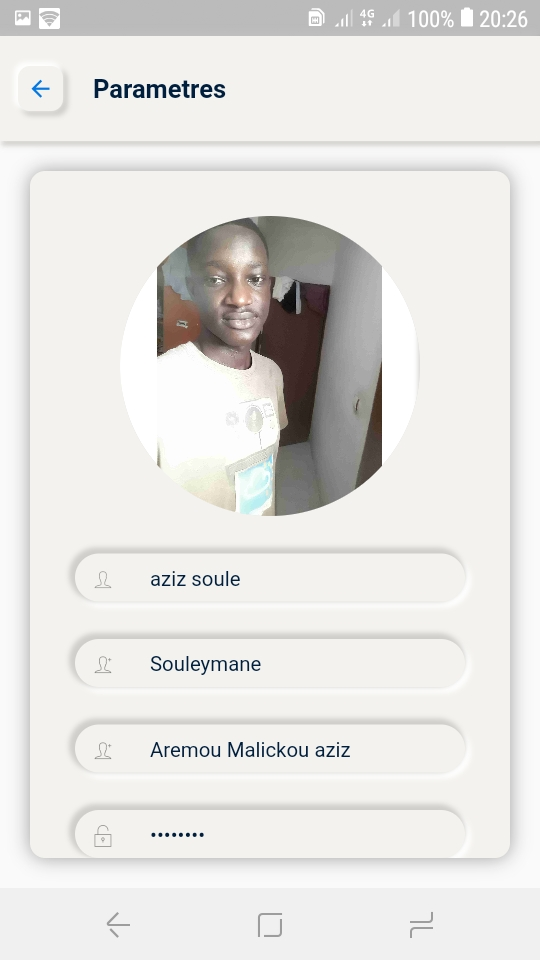
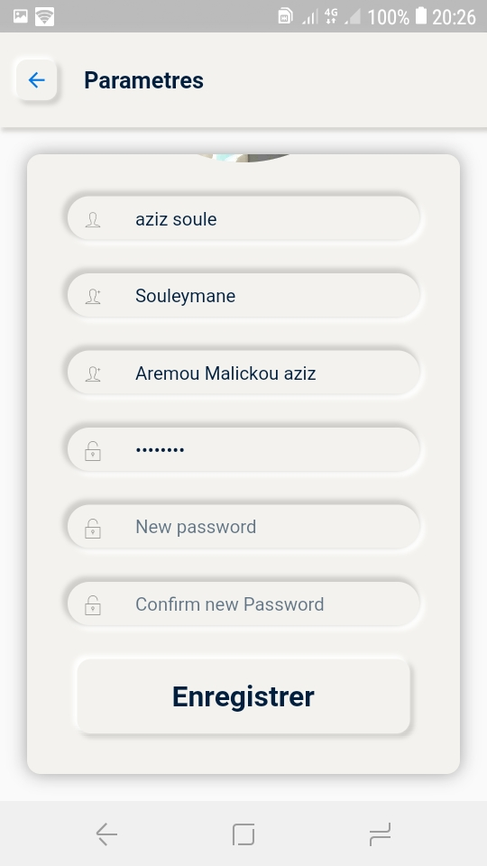
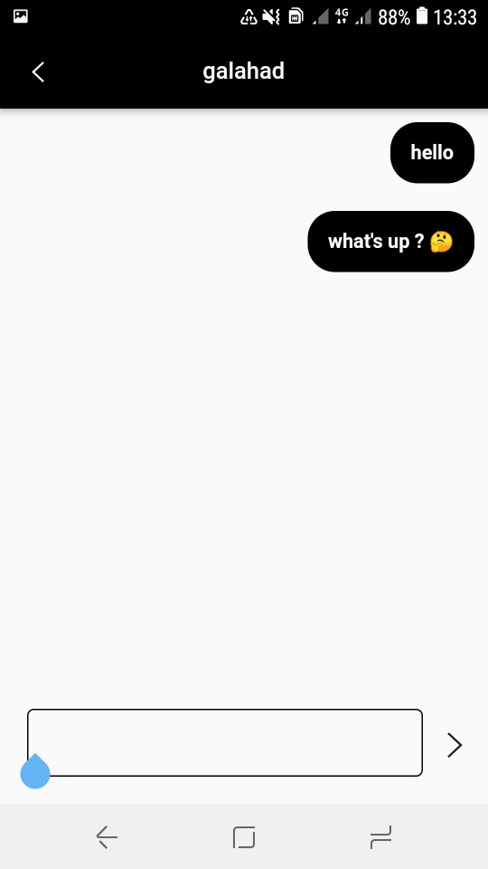

# lets_chat

A new Flutter application.
I want to build a messaging app using firebase.
 
In my app anybody who has an account can discuss with someone else who has an account.

⚠️ This Application is not finished.

## Getting Started

This project is a starting point for a Flutter application.

A few resources to get you started if this is your first Flutter project:

- [Lab: Write your first Flutter app](https://flutter.dev/docs/get-started/codelab)
- [Cookbook: Useful Flutter samples](https://flutter.dev/docs/cookbook)

For help getting started with Flutter, view our
[online documentation](https://flutter.dev/docs), which offers tutorials,
samples, guidance on mobile development, and a full API reference.

# Screenshots

